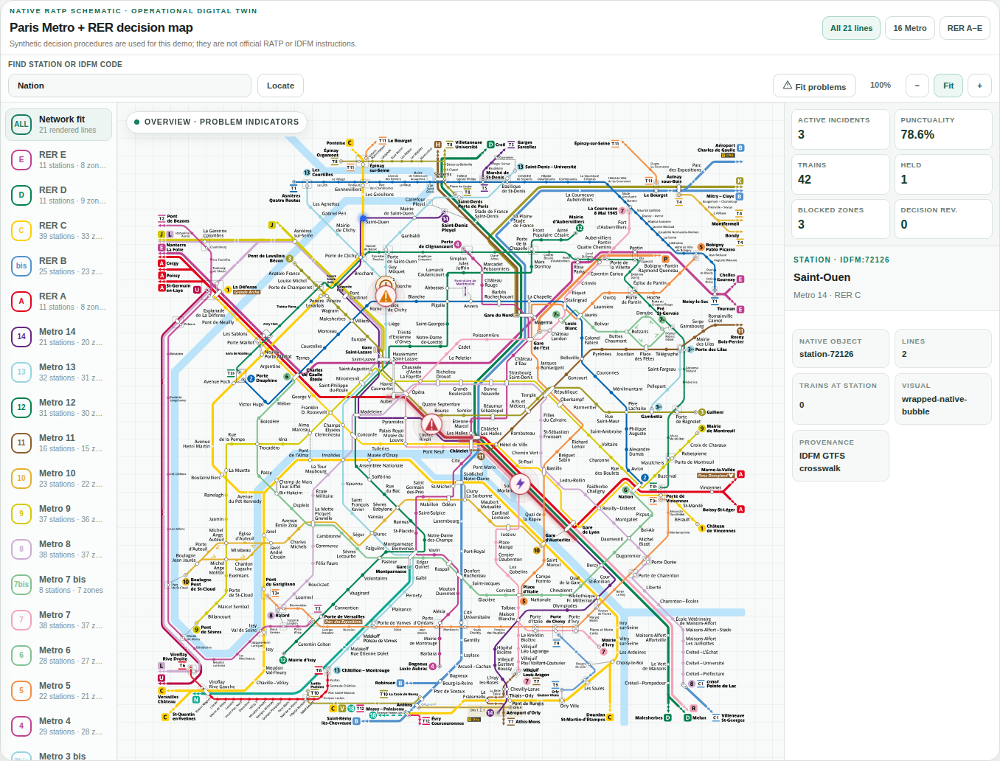

# Paris ICC - WebMCP Demo

Paris ICC is a browser demo of an operations control room for the Paris Metro and RER network.

The demo shows how an operator can handle an incident with help from an AI agent. The agent reads the same information as the operator, finds the matching procedure and suggests the next steps. The operator reviews every proposal and remains the only person who can apply an action.

At network level, Paris ICC acts as an **operational hypervisor** above the
control centre of each line. It does not replace local ICC responsibilities or
field authority. It gives a regional supervisor one shared workspace to
coordinate operations that cross line and mode boundaries: regulating connected
Metro and RER services, rerouting passengers, setting up provisional rail
services, dispatching maintenance, and running replacement buses. The demo
models this coordination layer with local data; it does not claim a live
connection to line control centres.

## What the demo does

The main screen is an interactive map of 21 Metro and RER lines. Trains occupy a station or an interstation, just as they would occupy a track section in an operations display. When the map is zoomed out, it shows the location of problems. When it is zoomed in, it shows trains, missions, delays and incident details.

The shared network view lets the supervisor prepare, approve and monitor a
multimodal response beyond the scope of any one local ICC, while each line
control centre keeps its own operational responsibility.

From the application, an operator can:

- follow train occupation across the network;
- create an incident on a station, an interstation, a train or an electrical asset;
- see the current impact on traffic and passengers;
- ask the agent to find the procedure that matches the incident code;
- review the proposed actions, their expected effects and their estimated duration;
- approve procedure steps one by one;
- set up a provisional service, a train turnback or a shuttle-bus service;
- monitor passenger queues, train loads, delays, power and SCADA communication;
- keep a timestamped record of incidents and operator actions; and
- prepare and print the end-of-shift report.

## A simple incident example

An abandoned bag is reported at a station.

1. The incident appears on the network map at the reported time.
2. The operator opens it without leaving the map.
3. The agent reads the incident, the affected station, nearby trains, passenger load and current service restrictions through WebMCP.
4. It finds the matching local procedure and shows where each proposed step comes from.
5. The operator approves the steps in order. The modal keeps the completed steps and their results visible.
6. If the disruption lasts, the agent can suggest passenger information, a provisional service and a shuttle plan.
7. Every approved action is written to the operations log and included in the shift report.

The same flow is used for station closures, blocked interstations, communication failures, power incidents and immobilised trains.

## What WebMCP adds

This is not a chatbot placed next to a dashboard. The page exposes its current operational context as typed WebMCP tools.

The agent can use those tools to:

- inspect the selected incident and its current revision;
- read the network state around the affected object;
- search the procedure library and open the exact document revision;
- estimate the effect and duration of the available response;
- use the network graph to find connections, turnback points and reinforcement options;
- propose the next valid procedure step; and
- refresh its analysis after the operator applies an action.

Without this connection, the operator would have to copy information from the map, incident list, procedure documents and logs into a separate assistant. Here, the agent reads that context directly from the page and returns its proposal inside the incident workflow.

The application registers 19 typed WebMCP tools. Read-only tools can inspect the current state. Tools that change the state require a visible, one-time operator approval. Incident revisions and procedure hashes are checked again before a change is accepted, so an old recommendation cannot silently be applied to a newer situation.

## Main parts of the product

- **Network overview** — Interactive SVG map, semantic zoom, train occupation and incident handling.
- **Passenger flow** — Network heatmap, passenger queues by station and train load.
- **Incident workflow** — Situation, impact, proposed response, procedure steps and return to normal in one modal.
- **Procedures** — Fourteen local demo procedures with versions, step durations and an editor.
- **Delays and regulation** — One line at a time with its full synoptic, trains, delays, production and crowding.
- **SCADA** — Field signalling, traction, train telemetry, ATS and passenger-information links for each line.
- **Bus services** — Operator-approved shuttle services with simulated round trips.
- **Rolling stock** — Capacity references and a relative load/traction estimate for each line.
- **Schedules and drivers** — CSV loading with preview, impact review, approval and application before D-1 service.
- **Operations log** — Incidents and actions recorded with server timestamps.
- **Shift report** — Editable report drafted from the operations log, then frozen and printed as PDF.
- **SimView** — Tables for trains, incidents, power and the other local data used by the demo.

## What is simulated

By default, the application runs with deterministic local data. Train positions, incidents, passenger queues, crews, track occupation, traction power and procedure actions are part of the demo.

The procedures were written for this project. They are examples, not RATP or IDFM operating instructions.

An optional IDFM PRIM connector can provide passenger-information data. It does not provide signalling commands, track-circuit state or continuous train positions. The application never sends a command to a real railway system.

The server stores the current demo state in an embedded SQLite file. Refreshing the browser or restarting the server keeps the current shift. The red **Reset** button starts again from the configured baseline.

## Run it locally

You need Node.js 20 or newer. Node.js 22 LTS is recommended.

~~~bash
npm ci
npm run dev
~~~

Open the address printed by Vite.

This mode needs no API key. It uses the local scenario and a deterministic procedure-based response when the OpenAI agent is not running.

## Run it with the OpenAI agent

Use the application server when you want authentication, the OpenAI agent, SQLite persistence and the optional PRIM connector.

~~~bash
npm run configure:server
npm run build
npm run serve
~~~

The configuration command asks for an access code and an OpenAI API key. It writes them to the ignored file `config/server.local.json`; the API key is never sent to the browser.

The server listens on `127.0.0.1:8787` by default. The **Configuration** button in the header lists the current OpenAI models compatible with the full agent workflow and shows only the reasoning efforts supported by each model. The selected model and effort are persisted together.

The **Agent instruction** tab edits the analysis focus for each of the nine incident types. Initial values come from `agent.incidentInstructions` in the private server JSON. Saved changes persist on the server and can be exported or imported as a versioned JSON file containing instructions only. After WebMCP verifies the selected incident type, its matching instruction is used for the remaining procedure-search and recommendation rounds. It cannot override verified evidence, the retrieved procedure or operator approval.

The same workspace also imports or exports the simulator baseline and provides the downloadable agent log.

For an HTTPS deployment, put Nginx in front of the Node process and set `application.publicOrigin` to the public address. The project does not need Docker, systemd or an external database. See [the deployment guide](docs/deployment.md).

## Main screens

| Route | What it shows |
| --- | --- |
| `#/overview` | Network map and incident workflow |
| `#/passenger-flow` | Passenger heatmap, station queues and train loads |
| `#/simulator` | Local data tables, incident creation and train insertion |
| `#/procedures` | Procedure library and step editor |
| `#/schedules-drivers` | D-1 schedule and driver preparation |
| `#/incidents` | Active, planned and past incidents |
| `#/regulation` | Line synoptic, occupation, delays and crowding |
| `#/power` | Traction-power state |
| `#/scada` | Field-to-ATS architecture and communication incidents |
| `#/bus-services` | Shuttle-bus plans and current services |
| `#/rolling-stock` | Capacity and relative traction estimates |
| `#/operations-log` | Current-shift incident and action history |
| `#/shift-report` | End-of-shift report and PDF output |

## Run the checks

~~~bash
npm run check:server
npm run check
npm run check:rail-graph
npm test
npm run test:rail-graph
npm run build
~~~

## Documentation

- [Documentation index](docs/README.md)
- [Operator guide](docs/operator-guide.md)
- [Architecture](docs/architecture.md)
- [WebMCP and agent](docs/webmcp-agent.md)
- [Simulation and procedures](docs/simulation-procedures.md)
- [Data sources and limits](docs/data-sources-boundaries.md)
- [Deployment](docs/deployment.md)
- [Development and validation](docs/development-validation.md)

## Project status

This is a demonstration project. It is not connected to a live control system and is not a safety or signalling product.

The application code is released under the MIT licence. Source information for the network, ridership and rolling-stock references is listed in the documentation.
