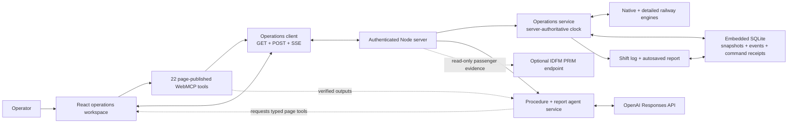
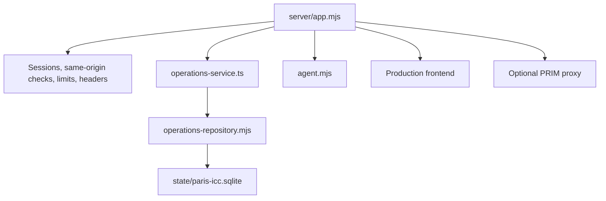
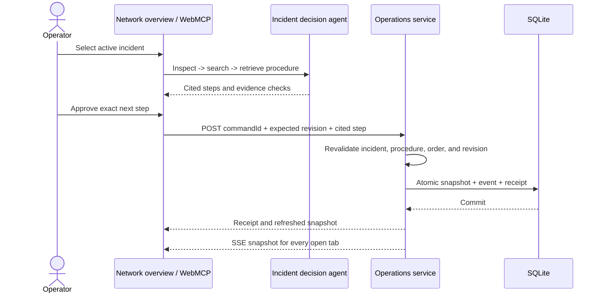

# Paris ICC architecture

## Purpose and operating envelope

Paris ICC is a complete, runnable railway decision-support application. It
reproduces an end-to-end operational workflow in a simulated environment. The
runtime combines two deterministic railway engines, an interactive Paris network
schematic, a versioned procedure catalogue for the operational simulation,
page-published WebMCP tools, and an embedded decision-support agent.

> **Simulated environment — no real railway system connected.**

The application does **not** command signalling, interlocking, traction power,
publication, or staff systems. The bundled procedures are synthetic and are not
official RATP, IDFM, infrastructure-manager, or regulatory instructions.

## Macro view



The browser is the presentation and WebMCP publication boundary. The Node
operations service is the authority for mutable railway state. SQLite is an
embedded file store; no external database daemon is required.

## Browser responsibilities

The React application renders the map and operational pages, publishes the typed
WebMCP catalogue, displays one-shot approval for writes, and consumes the
server-authoritative snapshot through `src/runtime/operationsClient.ts`.

The client performs:

- `GET /api/operations/snapshot` for initial hydration and conflict recovery;
- `GET /api/operations/events` for a same-origin Server-Sent Events stream;
- `POST /api/operations/commands` for revision-bound, idempotent commands.

SSE snapshots are accepted only for the authenticated run and only when their
operational or telemetry cursor moves forward. A transient stream failure keeps
the last valid snapshot visible while the browser reconnects. UI-only state such
as zoom, selected modal, and a pending approval is intentionally not persisted.

WebMCP remains useful because an external or embedded agent discovers the same
bounded page tools the operator sees. Tool schemas and visible approval stay in
the page; successful mutations are delegated to the server operations service.

## Server responsibilities



`server/app.mjs` owns HTTP routing, authentication, request bounds, SSE lifecycle,
static delivery, agent calls, and the optional PRIM proxy. The process loads the
TypeScript operations service with Node's import hook:

```bash
node --import tsx server/index.mjs --config config/server.local.json
```

The operations service owns one runtime per authenticated session ID. It owns the
single one-second clock, both deterministic engines, the imported reset baseline,
the D-1 schedule workspace, the versioned procedure workspace, and procedure
execution progress. Opening more browser tabs does not create more simulation
clocks.

The repository uses `sql.js` and persists an ordinary SQLite file through atomic
replacement with mode `0600`. An exclusive same-host sidecar lock prevents a
second process from opening the same `sql.js` database; a stale lock is reclaimed
only when its recorded local owner is definitely dead. Its schema contains:

- `runtime_state` for the latest complete workspace snapshot;
- `operation_events` for the ordered bounded event journal;
- `command_results` for durable command receipts and idempotent replay;
- `schema_migrations` and SQLite `user_version` for forward migrations.

Every one-second tick still publishes the newest `streamRevision` when the engines advance. Telemetry-only
changes are checkpointed at most every five seconds instead of exporting the full
database on every tick. Decisions and operator commands are persisted immediately,
and shutdown flushes the latest dirty telemetry snapshot. The bounded SSE writer
keeps at most one pending snapshot per slow client, coalesces intermediate updates,
and drops heartbeats while backpressured.

## State ownership and lifetime

| State | Authority | Persistence |
|---|---|---|
| Authentication | Signed server cookie | Survives reload and server restart while the cookie and session secret remain valid. |
| Native and detailed railway state | Operations service | Complete snapshot in SQLite, scoped by authenticated session ID. |
| Passenger queues and train loads | Native railway snapshot | One fractional linear accumulator per line/station, integer waiting/cumulative exchange counters, and onboard loads; persisted, exportable and reset with the workspace. |
| Simulation clock and speed | Operations service | One server timer advances loaded workspaces; decisions are immediate, telemetry has a five-second maximum checkpoint interval and is flushed on shutdown. |
| Imported reset baseline | Operations service | Persisted inside the runtime snapshot. |
| D-1 schedule versions and committed receipts | Operations service | Persisted inside the runtime snapshot. |
| Procedure baseline | Static build | Immutable 14-document catalogue revision `2026.08.30.4`; never rewritten by workspace editing. |
| Procedure workspace overrides and history | Operations service | Active revision map and referenced version documents are persisted in SQLite. A lightweight projection is streamed to the browser; global Reset preserves it. |
| Procedure completed steps and recovery cursor | Operations service | Persisted inside the runtime snapshot and restored after reload/restart. Each execution pins the exact procedure ID, revision and content hash it started with. |
| Current-shift normalized log | Operations service | Persisted inside the runtime snapshot; successful incident transitions and operator decisions append timestamped evidence with monotonic shift sequence IDs. |
| End-of-shift report | Operations service | Sanitized rich HTML is autosaved in the runtime snapshot. Freeze is durable and rejects subsequent edits until workspace Reset. |
| Global `stateRevision` | Operations service | Persisted monotonic ordering and optimistic-concurrency guard. |
| Command receipt | SQLite repository | Durable by `(workspaceId, commandId)`; retry returns the original result. |
| Operation event | SQLite repository | Ordered per workspace and readable through the authenticated audit route. |
| WebMCP approval UI | Browser | Inline in the incident modal for procedure steps and shared dialog elsewhere; unfinished approval never survives reload. |
| Incident recommendation cache | Browser | Ephemeral; regenerated from current persisted evidence. |
| OpenAI agent run history | `AgentService` | Server memory with TTL; operational state remains durable if a run expires. |
| Effective agent model, incident instruction overrides and execution metadata log | `AgentRuntimeStore` | Atomically persisted in a private bounded JSON sidecar. Initial incident instructions come from the private server JSON; exports contain only the nine safe instruction entries, never credentials or agent evidence. |
| PRIM passenger evidence | Optional server proxy/browser cache | Read-only evidence, separate from railway state. |

A new authenticated session receives a separate workspace. Refreshing with the
same signed cookie restores the same workspace. If the server restarts with the
same configuration and SQLite file, the next request hydrates that workspace
from disk.

## Command consistency

Every operations command has this envelope:

```json
{
  "commandId": "client-generated-stable-id",
  "type": "set_speed",
  "expectedStateRevision": 42,
  "payload": { "speed": 0 }
}
```

The service serializes commands per workspace. A stale revision returns HTTP 409;
the client fetches the latest snapshot before exposing the conflict. Snapshot,
event, command receipt, and new revision are persisted atomically. Retrying a
committed `commandId`, including after a process restart, returns the durable
receipt without appending another event or applying the command twice.

Procedure publication uses the same command envelope. `update_procedure_step`
contains the expected procedure revision and content hash plus a strict patch for
one step. The service serializes the command with all other workspace mutations,
rejects stale identities and locked fields, creates a new revision/hash, persists
the active override and referenced document, and records a
`procedure-step-revision-published` shift-log event. Older versions remain
addressable because in-progress executions are pinned to exact identities.

A native response evaluation has a deterministic ID derived from the incident and
decision revision. If its in-memory cache is absent after restart or rollback, the
controller reconstructs the exact evaluation from the persisted decision state
before applying a reviewed option. Stale revisions remain rejected.

The domain-specific native `decisionRevision` remains the guard used by procedure
and operational reasoning. The server `stateRevision` orders the complete
cross-domain snapshot and its delivery to browsers.

## Incident-to-recovery flow



The model receives only the three read-only incident evidence tools. It never
receives the procedure apply tool. Approval is necessary but does not bypass
server validation.

The read path is workspace-aware: search resolves the active procedure revision,
then retrieval requires its exact ID, revision, and hash. An existing execution
continues to resolve its pinned historical revision even after a human publishes
a newer active override.

## Shift evidence and end-of-shift reporting

Every successful domain command passes through one centralized shift-log
normalizer before its updated snapshot is committed. It records a server receipt
time, the applicable operational clock time, actor, category, event type, summary,
incident and entity links, and an elapsed incident duration where one exists.
The server tick also records automatic incident activations and status transitions.
Routine report autosaves are deliberately omitted from the readable chronology;
an agent draft and final freeze are retained as decision-support/operator events.

The report page sends rich-text edits through the same revision-bound command API
after a 700 ms idle interval. The server sanitizes a bounded HTML allowlist before
persisting it. The embedded agent receives only the page-published
`inspect_shift_log` definition, requests each chronological page, and the browser
executes those requests through WebMCP against the authenticated current-shift
workspace. The run pins the shift ID and latest sequence across all pages.
`POST /api/reports/assist` does not accept log evidence from the browser: it
reloads the authoritative shift, checks the WebMCP-observed identity and sequence,
validates every draft citation against the exact available log IDs, then renders
and sanitizes the HTML. With OpenAI disabled, WebMCP inspection still precedes the
deterministic complete chronology.

Freezing is a persisted domain command, not a visual toggle. It rejects later
edits and agent drafts until Reset, after which browser printing supplies the A4
PDF/save dialogue. Reset begins a new normalized shift log and draft. The separate
SQLite repository event journal and idempotent command receipts continue to retain
the lower-level technical history.

## HTTP routes

| Route | Method | Session | Purpose |
|---|---:|:---:|---|
| `/healthz` | `GET` | No | Service, data mode, and SQLite readiness. |
| `/api/session` | `GET` | No | Public runtime configuration and authentication state. |
| `/api/auth/login` | `POST` | No | Same-origin access-code login and signed cookie. |
| `/api/auth/logout` | `POST` | No | Expires the session cookie. |
| `/api/operations/snapshot` | `GET` | Yes | Current complete operations snapshot and revision ETag. |
| `/api/operations/events` | `GET` | Yes | Unbuffered SSE snapshot stream with 15-second heartbeats. |
| `/api/operations/commands` | `POST` | Yes | Same-origin, revision-bound idempotent mutation. |
| `/api/operations/audit?after=N` | `GET` | Yes | Up to 100 ordered persisted events after sequence N. |
| `/api/configuration` | `GET` | Yes | Safe effective model metadata, incident-instruction registry, allowlist, and retained agent-log count. |
| `/api/configuration/agent` | `PUT` | Yes | Same-origin update of the exact allowlisted model for future runs. |
| `/api/configuration/agent-instructions` | `PUT` | Yes | Same-origin, complete and versioned replacement of all nine incident instructions. |
| `/api/configuration/agent-instructions/export` | `GET` | Yes | Credential-free JSON attachment of the saved incident instructions. |
| `/api/agent/turn` | `POST` | Yes | One bounded agent turn. |
| `/api/agent/reset` | `POST` | Yes | Clears an in-memory agent run. |
| `/api/agent/log` | `GET` | Yes | Newest-first bounded metadata-only agent execution log. |
| `/api/agent/log/download` | `GET` | Yes | Versioned JSON attachment of the retained safe agent log. |
| `/api/reports/assist` | `POST` | Yes | Rechecks the WebMCP-observed shift revision, validates citations, and returns sanitized editable report HTML. |
| `/api/prim-line` | `GET` | Yes | Optional allowlisted read-only PRIM proxy. |
| Other non-API paths | `GET`/`HEAD` | No | Static build and SPA fallback. |

## Shutdown and recovery

`server/index.mjs` handles `SIGINT` and `SIGTERM`. Shutdown rejects new streams,
closes existing SSE responses, stops accepting and drains HTTP work, then stops the
operations timer, waits for queued workspace mutations, flushes dirty telemetry,
and closes the repository. The private control script verifies
the exact `node --import tsx ...` command and the owner of port 8787 before
stopping a process.

The database path is configured by `storage.databasePath`, resolved relative to
the private JSON file. Deployment keeps it outside the public Git repository.
Back up the SQLite file only after stopping the server when an exact point-in-time
copy is required.

## Boundaries

- The embedded repository is deliberately single-process; its exclusive lock prevents
  accidental concurrent writers but is not a multi-node database.
- SQLite durability makes reload and restart reliable; it is not an immutable,
  regulated railway audit archive or a backup strategy.
- Agent run history remains deliberately ephemeral. A new incident analysis can
  be rebuilt from persisted evidence; report assistance reads the durable shift log
  for every request and does not rely on run memory.
- The shared access code is appropriate for controlled access to this simulated
  environment, not as a production identity or role-management system.
- The two deterministic engines reproduce operational behaviour; they do not provide
  live signalling or certified operational telemetry.
- PRIM remains passenger-information evidence only.
- Procedure editing supports the simulated workspace; it is not a regulatory
  document-management or independent approval system.
