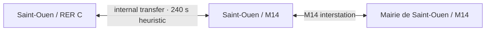

# Rail interdependence graph

## Purpose

The rail interdependence graph is the canonical navigation layer between the
complete IDFM topology and the native SVG. It supports route finding, closures,
line changes, documented connections between differently identified stations,
and bounded incident-impact analysis without changing the map geometry.

The three auditable artifacts are:

- [`artifacts/rail-interdependence-graph.json`](../artifacts/rail-interdependence-graph.json):
  generated graph;
- [`artifacts/rail-station-connections.json`](../artifacts/rail-station-connections.json):
  compact allow-list and evidence for cross-station connections;
- [`artifacts/rail-interdependence-graph-validation.json`](../artifacts/rail-interdependence-graph-validation.json):
  independent conformity and traceability inventory.

## Graph model

The graph is a typed undirected multigraph with derived directed traversal
arcs. A physical station groups one node per line:



This prevents an implicit zero-cost change between lines. The entity contracts
are:

- `stations`: 546 physical IDFM hubs, with their line memberships and optional
  native-SVG station objects;
- `lineNodes`: 658 station-line states used by the traversal engine;
- `interstations`: 640 rail links, each belonging to exactly one line and
  joining two line nodes on that line;
- `transfers`: 163 links joining two different line nodes inside the same
  physical station;
- `stationConnections`: 28 documented links joining two distinct station hubs;
- `lines`: 21 Metro and RER lines with exact node and interstation membership.

The 28 station connections expand to 98 undirected line-node pairs. Together
with the 640 interstations and 163 internal transfers, the graph derives 1,802
directed traversal arcs and has one connected component. Lines M7 bis and M10
retain their source loops; all normalized line graphs remain connected.

## Cross-station selection policy

The IDFM GTFS snapshot contains 184 cross-station pairs in `transfers.txt`.
Those rows include ordinary walking-proximity candidates between neighboring
stations, so importing them all would create false railway shortcuts.

The committed inventory uses an explicit documented allow-list. Twenty-five
pairs have reciprocal GTFS evidence. Three additional public-way pairs are
individually named by IDFM decision 20251017-192, have been active since 1 April
2026, and are deliberately labelled `official-documentary` because the current
GTFS does not expose them as cross-station transfers:
Gare de l'Est–Magenta, Gare du Nord–Poissonnière, and
Magenta–Poissonnière.

| Category | Count | Default routing | Meaning |
| --- | ---: | --- | --- |
| `interchange-complex` | 8 | Included | Documented station complex or internal passenger corridor |
| `public-way-authorized` | 16 | Included | Connection listed by IDFM through public space |
| `mapped-walking-link` | 4 | Opt-in | Walking link shown on the RATP map; fare continuity is not inferred |

The result is 28 selected pairs: 25 selected from the 184 audited GTFS
cross-station pairs, three supported directly by the current IDFM decision, and
159 GTFS proximity pairs deliberately excluded. Each object records endpoint
IDs, line memberships, its selection basis, GTFS transfer/pathway evidence when
available, documentary references, and a deterministic cost. The three
documentary-only costs are visibly marked estimates based on geodesic distance,
1.2 m/s walking speed, and 120 seconds of station access; they are not published
journey times.

The audited sources are the daily
[IDFM GTFS dataset](https://prim.iledefrance-mobilites.fr/jeux-de-donnees/offre-horaires-tc-gtfs-idfm),
the IDFM list of
[public-way correspondences](https://www.iledefrance-mobilites.fr/correspondance-voie-publique),
the [IDFM decision 20251017-192](https://www.iledefrance-mobilites.fr/medias/portail-idfm/aSQ1g2GnmrmGqKoq_RAA166-1.pdf),
and the RATP schematic identified in the native manifest. The verified GTFS ZIP
has SHA-256
`65bc30078a0ca8ec865602bf84959068089d29d641d5ba78db66bd09538d57cf`.
Regeneration on 29 August 2026 produced the same stable undirected railway
structure as the committed topology: 21 lines, 546 stations, 658 station-line
occurrences, and 640 interstations.

## SVG projection

The operational graph remains complete even where the official schematic
contracts or omits an outer branch:

- 390 graph stations reference visible native station objects;
- 546 operational interstations project onto 467 native SVG interstation
  objects;
- 94 operational interstations remain navigable but are outside the rendered
  plan;
- a contracted SVG interstation can represent several consecutive operational
  links, and the reverse mapping is explicit in `svgProjection`.

No hit layer or replacement geometry is introduced. Route and impact results
return the native station and interstation IDs that can be selected or animated
directly. A station connection references its two existing endpoint station
objects; it does not draw another line over the SVG.

## Runtime API

[`interdependenceGraph.ts`](../src/rail/interdependenceGraph.ts) validates the
fixture at import time, derives exactly 1,802 arcs, and exports stable indexes,
adjacency, routing, and impact analysis.

### Route finding

```ts
import { findRailRoute } from "./rail/interdependenceGraph";

const route = findRailRoute("IDFM:478926", "IDFM:71337", {
  maxTransfers: 1,
  stationConnectionPolicy: "official-only",
  blockedStationConnectionIds: [],
});
```

The example uses the documented Auber–Opéra connection. A route returns ordered
station IDs, rail lines, interstations, internal transfer IDs, separate
`stationConnectionIds`, estimated duration, and SVG objects.

`stationConnectionPolicy` has three values:

- `official-only` (default): station complexes and IDFM-authorized public-way
  connections;
- `all`: also use the four mapped walking links;
- `none`: traverse only rail interstations and internal same-station transfers.

The default rail weights are deterministic navigation heuristics, not timetable
predictions. Cross-station weights are rounded medians of reciprocal GTFS
`min_transfer_time` observations when present. The three documentary-only
weights use the labelled geometric walking model described above. Applications
may replace all costs at runtime.

Closures, blocked connections, blocked stations, and disabled lines are hard
traversal exclusions.

### Impact envelope

```ts
import { analyzeRailImpact } from "./rail/interdependenceGraph";

const impact = analyzeRailImpact(
  { stationConnectionIds: ["station-connection:474151--71264"] },
  {
    maxElapsedSeconds: 900,
    maxTransfers: 1,
    stationConnectionPolicy: "official-only",
  },
);
```

An incident may start from stations, interstations, station connections, or
lines. The result separates:

- `direct`: the incident object and its endpoint stations;
- `primary`: same-line propagation before a correspondence;
- `secondary`: propagation reached through an internal transfer or a selected
  station connection.

`affectedInterstations`, `affectedTransfers`, and
`affectedStationConnections` remain separate collections. The result is a
bounded topological envelope, not a delay forecast. Passenger demand, rolling
stock circulation, signalling, causal incident rules, and recovery actions
require separate operational inputs.

## Reproducibility and verification

Regenerate the compact connection inventory from an IDFM GTFS ZIP, then rebuild
and verify the graph:

```bash
npm run build:rail-connections -- --gtfs /path/to/IDFM-gtfs.zip
npm run build:rail-connections -- --gtfs /path/to/IDFM-gtfs.zip --check
npm run build:rail-graph
npm run check:rail-graph
npm run test:rail-graph
npx vitest run src/rail/interdependenceGraph.test.ts
```

The independent validator checks source hashes, schemas, collection counts, ID
uniqueness, station-line/source-edge/connection bijections, both evidence modes,
connection categories, all 98 line-node expansions, line and global
connectivity, all 1,802 arcs, contracted-chain mappings, and every projected
station/interstation/path ID in the native SVG. Its current result is 27 global
checks passed, 28/28 station connections passed, and zero listed exceptions.
